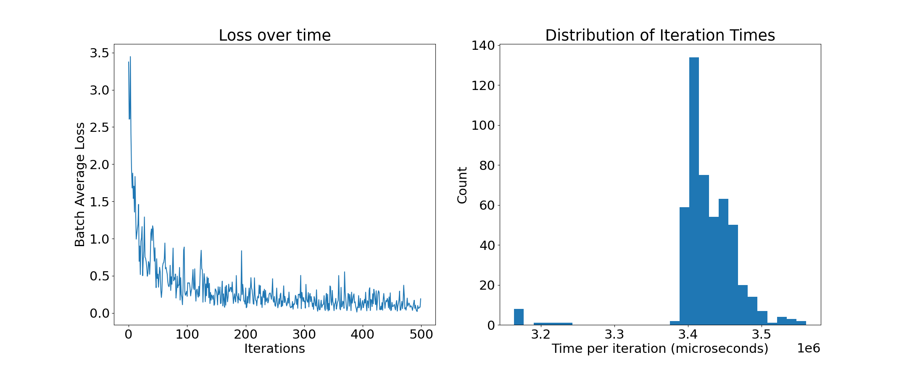
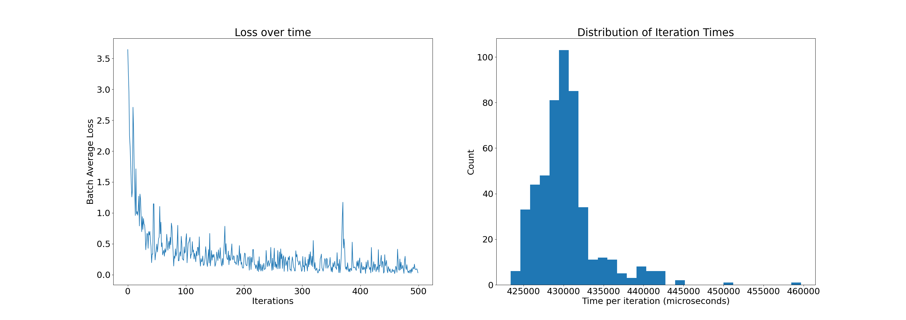
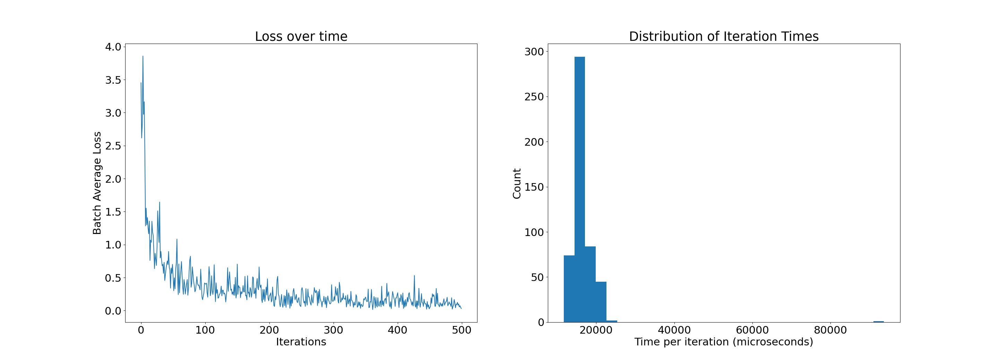
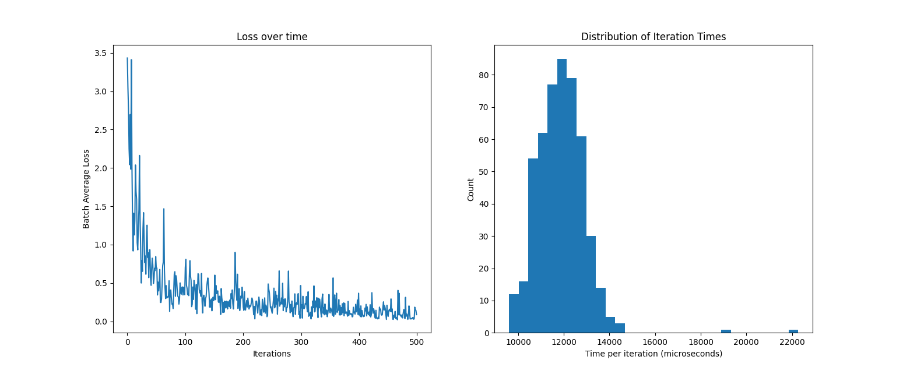

# cuda-toy

The goal of this project is to implement a simple neural network in C++ that is GPU accelerated via CUDA.

### Goals
- [DONE] Implement non-accelerated net
- [DONE] Optimize net architecture a little for MNIST data
- [DONE] Implement CUDA-accelerated matrix functions
- [DONE] Quantitatively compare accelerated vs non-accelerated performance

## Results
### CPU with `std::vector`

Mean iteration time ~ 3430 ms
### CPU with arrays

Mean iteration time ~ 428 ms
### CPU with GPU matrix multiplication

Mean iteration time ~ 18 ms
### CPU with GPU matrix arithmetic

Mean iteration time ~ 12 ms
